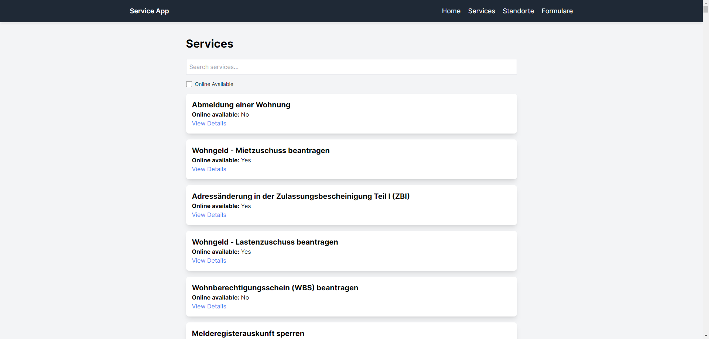
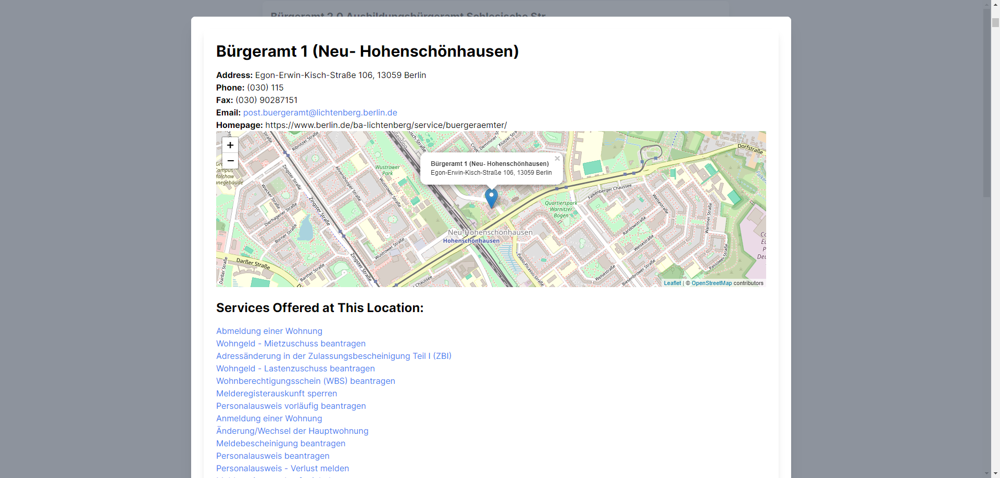
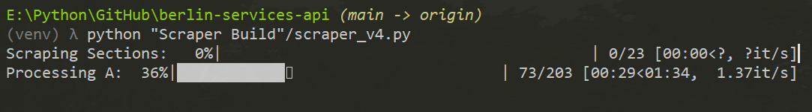

# Berlin Services API

Berlin Services API is a web application that scrapes, stores, and presents information about various services offered by the city of Berlin. It provides a user-friendly interface to explore services and their associated locations (Standorte).

## Table of Contents

1. [Features](#features)
2. [Technology Stack](#technology-stack)
3. [Project Structure](#project-structure)
4. [Installation](#installation)
5. [Usage](#usage)
6. [API Endpoints](#api-endpoints)
7. [Frontend](#frontend)
8. [Data Scraping](#data-scraping)
9. [Database](#database)

## Features

- Scrapes service and location data from the official Berlin service portal
- Stores data in a SQLite database
- Provides API endpoints for accessing service and location information
- Offers a user-friendly web interface to browse services and locations
- Implements a search functionality for services and locations
- Displays detailed information about services and locations in modal popups

## Technology Stack

- Backend: FastAPI (Python)
- Frontend: HTML, CSS (Tailwind CSS), JavaScript
- Database: SQLite with SQLModel ORM
- Scraping: BeautifulSoup4, Requests
- API: RESTful with JSON responses

## Project Structure

The project is organized as follows:

```
berlin-services-api/
├── app/
│   ├── controllers/
│   │   ├── formular_controller.py
│   │   ├── service_controller.py
│   │   └── standort_controller.py
│   ├── static/
│   │   ├── js/
│   │   │   └── main.js
│   ├── templates/
│   │   ├── base.html
│   │   ├── formular_detail.html
│   │   ├── formulare.html
│   │   ├── service_detail.html
│   │   ├── services.html
│   │   ├── standort_detail.html
│   │   └── standorte.html
│   ├── views/
│   │   ├── formular_view.py
│   │   ├── service_view.py
│   │   └── standort_view.py
|   ├── main.py
|   └── models.py
├── Scraper Build/
|   ├── read_db.py
│   └── scraper_v4.py
├── services.db
├── README.md
└── requirements.txt
```

- `app/`: Contains the main application code
- `app/controllers/`: Implements API endpoints and route handlers
- `app/static/`: Stores static files
- `app/templates/`: Stores HTML (Jinja2) templates for the frontend
- `app/views/`: Implements API endpoints and route handlers
- `app/main.py`: Entry point for the FastAPI application
- `app/models.py`: Defines database models
- `Scraper Build/`: Houses the scraping scripts
- `services.db`: SQLite database file
- `requirements.txt`: Lists the project dependencies

## Installation

1. Clone the repository:
   ```
   git clone https://github.com/tobiasseck/berlin-services-api.git
   
   cd berlin-services-api
   ```

2. Create a virtual environment and activate it:
   ```
   python -m venv venv
   
   # On Windows
   venv\Scripts\activate.bat

   # On macOS and Linux
   source venv/bin/activate
   ```

3. Install the required dependencies:
   ```
   pip install -r requirements.txt
   ```

## Usage

1. Run the scraper to populate the database (if not already done - a full scrape of the site can take up to 20 minutes):
   ```
   python "Scraper Build"/scraper_v4.py
   ```

2. Start the FastAPI server:
   ```
   uvicorn app.main:app --reload
   ```

3. Open your web browser and navigate to `http://localhost:8000/services/` to access the application.

## API Endpoints

The following API endpoints are available:

- `GET /api/services/`: List all services
- `GET /api/services/{service_id}`: Get details of a specific service
- `GET /api/standorte/`: List all locations (Standorte)
- `GET /api/standorte/{standort_id}`: Get details of a specific location
- `GET /api/formulare/`: List all forms
- `GET /api/formulare/{formular_id}`: Get details of a specific form

For more detailed API documentation, visit `http://localhost:8000/docs` after starting the server.

## Frontend

The frontend is built using HTML, Tailwind CSS, and JavaScript. It provides a responsive and intuitive interface for users to browse services and locations. Key features include:

- Search functionality for services and locations
- Modal popups for detailed service and location information
- Interactive map display for location addresses
- On-demand loading of service and location data

Examples of the frontend:
- Overview of all services

- Detailed view of a single location


## Data Scraping

The data scraping process is implemented in the `scraper_v4.py` file. It uses BeautifulSoup4 to parse HTML content from the official Berlin service portal. The scraper extracts information about services, their details, and associated locations.

Example of the scraper in action:
- As a full scrape can take up to 20 minutes, the scraper will not run automatically on startup. Instead, the scraper can be run from the command line. While running progress is displayed in the console to show the user what data is currently being scraped.



## Database

The project uses SQLite with SQLModel ORM for data storage. The database schema is defined in the `app/models/` directory. Key models include:

- `Service`: Represents a city service
- `ServiceDetail`: Stores detailed information about a service
- `Standorte`: Represents a location where services are offered
- `StandorteServices`: Manages the many-to-many relationship between services and locations
- `Formular`: Represents a form associated with a service
- `FormularDetail`: Stores detailed information about a form
- `FormularStandorte`: Manages the many-to-many relationship between forms and locations
